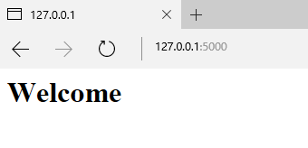
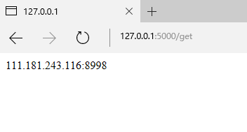
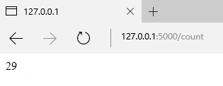
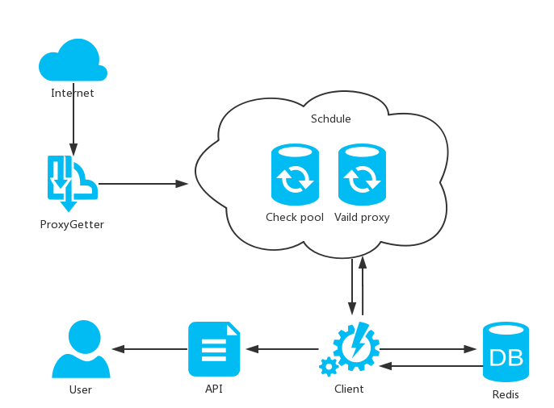

# ProxyPool
[](https://travis-ci.org/WiseDoge/ProxyPool)   
跨语言高性能IP代理池，Python实现。    

注意：请运行程序前先更新一下抓取代理的函数。

## 运行环境

* Python 3.5

  (请务必保证Python的版本在3.5以上，否则异步检验无法使用。)

* Redis 

  Redis官网并没有提供Windows的安装版，Windows用户可以[点击此处](http://pan.baidu.com/s/1kVe6lc7)下载一个我自己编译的二进制版本(3.2版本2.7MB，VS 2015编译)。

## 安装

### ① 直接使用

#### 安装依赖

`$ pip install -r requirements.txt`

*Windows用户如果无法安装lxml库请[点击这里](http://www.lfd.uci.edu/~gohlke/pythonlibs/)*。

#### 打开代理池和API

`$ cd proxypool`

`$ python3 run.py `

### ② 安装使用

#### 安装

`$ cd proxypool`

`$ python setup.py install`

#### 打开代理池和API

`$ proxypool_run`

### ③ 使用二进制包

Windows 用户可以[点击此处](http://pan.baidu.com/s/1c1XsVEo)获取此程序的二进制包，直接运行。

## 使用API获取代理

访问`http://127.0.0.1:5000/`进入主页，如果显示'Welcome'，证明成功启动。



访问`http://127.0.0.1:5000/get`可以获取一个可用代理。  



访问`http://127.0.0.1:5000/count`可以获取代理池中可用代理的数量。  



也可以在程序代码中用相应的语言获取，例如:

```
import requests
from bs4 import BeautifulSoup
import lxml

def get_proxy():
    r = requests.get('http://127.0.0.1:5000/get')
    proxy = BeautifulSoup(r.text, "lxml").get_text()
    return proxy
```

## 各模块功能

* proxyGetter.py

  > 爬虫模块

  * class proxypool.proxyGetter.FreeProxyGetter

    > 爬虫类，用于抓取代理源网站的代理，用户可复写和补充抓取规则。

* schedule.py

  > 调度器模块

  * class proxypool.schedule.ValidityTester

    > 异步检测类，可以对给定的代理的可用性进行异步检测。

  * class proxypool.schedule.PoolAdder

    > 代理添加器，用来触发爬虫模块，对代理池内的代理进行补充，代理池代理数达到阈值时停止工作。

  * class proxypool.schedule.Schedule

    > 代理池启动类，运行RUN函数时，会创建两个进程，负责对代理池内容的增加和更新。

* db.py

  > Redis数据库连接模块

  * class proxypool.db.RedisClient

    > 数据库操作类，维持与Redis的连接和对数据库的增删查该，

* error.py

  > 异常模块

  * class proxypool.error.ResourceDepletionError

    > 资源枯竭异常，如果从所有抓取网站都抓不到可用的代理资源，
    >
    > 则抛出此异常。

  * class proxypool.error.PoolEmptyError

    > 代理池空异常，如果代理池长时间为空，则抛出此异常。

* api.py

  > API模块，启动一个Web服务器，对外提供代理的获取功能。

* utils.py

  > 工具箱

* setting.py

  > 设置

